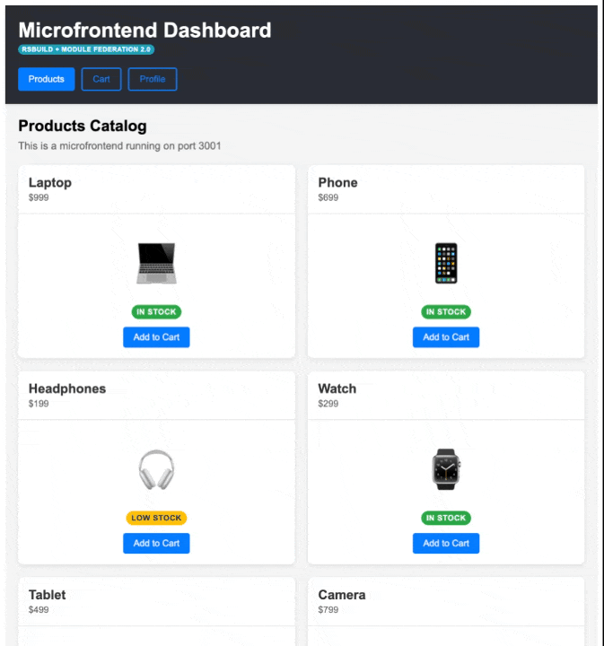
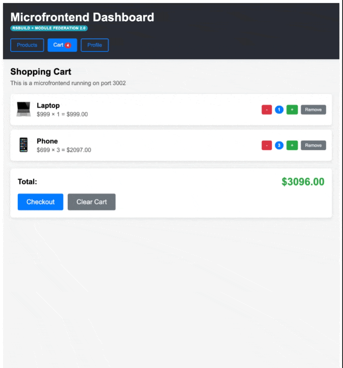

# Microfrontend Dashboard with Rsbuild and Module Federation

This project demonstrates the microfrontend concept using **Rsbuild with Module Federation 2.0** and **Turborepo**.

## Architecture

The application consists of:

- **Host (Port 3000)**: Main container application that orchestrates the microfrontends
- **Products (Port 3001)**: Product catalog microfrontend
- **Cart (Port 3002)**: Shopping cart microfrontend
- **Profile (Port 3003)**: User profile microfrontend

Each microfrontend can run independently or be consumed from the host via Module Federation 2.0.

## Demo

### Navigation Between Microfrontends

The application provides seamless navigation between different microfrontends, each running independently but integrated through the host application.



Each microfrontend (Products, Cart, Profile) has its own UI and functionality while sharing the same layout and state management.

### Adding Products to Cart

Products can be added to the global cart state from the Products microfrontend. The cart state is managed by the host and shared across all microfrontends in real-time.


This demonstrates:
- Adding products to the cart from the Products microfrontend
- Real-time cart count update in the header
- Navigating to the Cart microfrontend to view added products
- Managing quantities and removing items

### Checkout and Profile Management

After adding products to the cart, users can proceed to checkout and then navigate to the Profile microfrontend to manage their user data.



This demonstrates:
- Completing the checkout process from the Cart microfrontend
- Navigating to the Profile microfrontend
- Updating user information independently

## Quick Start

### Install dependencies

```bash
npm install
```

### Run all microfrontends

```bash
npm run dev
```

This will start all microfrontends simultaneously on their respective ports:
- Host: http://localhost:3000
- Products: http://localhost:3001
- Cart: http://localhost:3002
- Profile: http://localhost:3003

### Run individual microfrontends (Standalone Mode)

Each microfrontend can run independently with mock data:

```bash
# Products only (with mock cart)
npm run dev --filter=products
# Visit http://localhost:3001

# Cart only (with mock data)
npm run dev --filter=cart
# Visit http://localhost:3002

# Profile only
npm run dev --filter=profile
# Visit http://localhost:3003
```

**Note**: When running standalone, microfrontends use mock implementations:
- **Products**: Mock `addToCart` shows an alert
- **Cart**: Pre-populated with sample items, fully functional mock
- **Profile**: Runs normally (doesn't depend on cart)

For full functionality with real state sharing, run from the host (`npm run dev`).

## Build for production

```bash
npm run build
```

## Demonstrated Features

### Rsbuild + Module Federation 2.0
- **High performance**: Rsbuild is based on Rspack (Rust), providing much faster build times than Webpack
- **Module Federation 2.0**: Enhanced version with dynamic TypeScript support, better runtime, and improved dev experience
- **Component exposure**: Each microfrontend exposes its components through `exposes`
- **Remote consumption**: The host consumes remote components through `remotes`
- **Shared dependencies**: React, React-DOM, and shared UI library are shared as singletons
- **Manifest-based federation**: Uses `mf-manifest.json` for more reliable module discovery
- **Shared UI library**: Common UI components (Button, Card, Badge) shared across all microfrontends

### Turborepo
- **Monorepo**: All projects in a single repository
- **Workspaces**: Shared dependency management
- **Parallel execution**: Multiple microfrontends running simultaneously

### Independence
- Each microfrontend can:
  - Run independently
  - Have its own development cycle
  - Be deployed independently
  - Be developed with different frameworks (although all use React here)

## Project Structure

```
microfrontend-app/
├── apps/
│   ├── host/              # Container application
│   │   ├── src/
│   │   │   ├── App.jsx
│   │   │   └── index.js
│   │   ├── public/
│   │   ├── rsbuild.config.js
│   │   └── package.json
│   ├── products/          # Products microfrontend
│   │   ├── src/
│   │   │   ├── ProductsApp.jsx
│   │   │   └── index.js
│   │   ├── public/
│   │   ├── rsbuild.config.js
│   │   └── package.json
│   ├── cart/              # Cart microfrontend
│   │   ├── src/
│   │   │   ├── CartApp.jsx
│   │   │   └── index.js
│   │   ├── public/
│   │   ├── rsbuild.config.js
│   │   └── package.json
│   └── profile/           # Profile microfrontend
│       ├── src/
│       │   ├── ProfileApp.jsx
│       │   └── index.js
│       ├── public/
│       ├── rsbuild.config.js
│       └── package.json
├── packages/              # Shared packages
│   └── shared-ui/         # Shared UI components library
│       ├── src/
│       │   ├── components/
│       │   │   ├── Button.jsx
│       │   │   ├── Card.jsx
│       │   │   └── Badge.jsx
│       │   ├── context/
│       │   │   ├── CartContext.jsx      # Real cart implementation
│       │   │   └── MockCartProvider.jsx # Mock for standalone mode
│       │   └── index.js
│       ├── rsbuild.config.js
│       └── package.json
├── turbo.json
└── package.json
```

## Rsbuild Configuration

### Host (Consumer)
```javascript
import { defineConfig } from '@rsbuild/core';
import { pluginReact } from '@rsbuild/plugin-react';
import { pluginModuleFederation } from '@module-federation/rsbuild-plugin';

export default defineConfig({
  server: { port: 3000 },
  plugins: [
    pluginReact(),
    pluginModuleFederation({
      name: 'host',
      remotes: {
        products: 'products@http://localhost:3001/mf-manifest.json',
        cart: 'cart@http://localhost:3002/mf-manifest.json',
        profile: 'profile@http://localhost:3003/mf-manifest.json',
      },
      shared: {
        react: { singleton: true, requiredVersion: '^18.2.0', eager: true },
        'react-dom': { singleton: true, requiredVersion: '^18.2.0', eager: true },
        '@microfrontend-app/shared-ui': { singleton: true, eager: true },
      },
    }),
  ],
});
```

### Microfrontends (Providers)
```javascript
import { defineConfig } from '@rsbuild/core';
import { pluginReact } from '@rsbuild/plugin-react';
import { pluginModuleFederation } from '@module-federation/rsbuild-plugin';

export default defineConfig({
  server: { port: 3001 },
  plugins: [
    pluginReact(),
    pluginModuleFederation({
      name: 'products',
      exposes: {
        './ProductsApp': './src/ProductsApp',
      },
      shared: {
        react: { singleton: true, requiredVersion: '^18.2.0' },
        'react-dom': { singleton: true, requiredVersion: '^18.2.0' },
        '@microfrontend-app/shared-ui': { singleton: true },
      },
    }),
  ],
});
```

## Global State Management

This application uses **React Context** for global state management, with both real and mock implementations centralized in the **shared-ui** library.

### Architecture

- **Real Implementation**: `CartProvider` from shared-ui, used by the host
- **Mock Implementation**: `MockCartProvider` and `createSimpleMockCartContext()` from shared-ui, used by standalone microfrontends
- **Props Drilling**: Cart context is passed as props to avoid React instance conflicts across microfrontends

### How It Works

1. **Host uses real CartProvider**: Wraps the entire app with `CartProvider` from shared-ui
2. **Host passes context as props**: Uses `useCart()` hook and passes the context object to microfrontends
3. **Microfrontends receive props**: Accept `cartContext` as a prop instead of importing hooks
4. **Standalone mode uses mocks**: Each microfrontend uses mock implementations from shared-ui when running independently

### CartContext API

```javascript
const cartContext = {
  cartItems,        // Array of items in cart
  addToCart,        // (product) => void
  removeFromCart,   // (productId) => void
  updateQuantity,   // (productId, delta) => void
  clearCart,        // () => void
  totalItems,       // number
  totalPrice,       // number
};
```

### Usage in Host

```javascript
// apps/host/src/index.js
import { CartProvider } from '@microfrontend-app/shared-ui';

root.render(
  <CartProvider>
    <App />
  </CartProvider>
);

// apps/host/src/App.jsx
import { useCart } from '@microfrontend-app/shared-ui';

function App() {
  const cartContext = useCart();

  return (
    <ProductsApp cartContext={cartContext} />
  );
}
```

### Usage in Microfrontends

```javascript
// Microfrontend receives context as prop
function ProductsApp({ cartContext }) {
  const addToCart = cartContext?.addToCart || (() => {});

  return (
    <button onClick={() => addToCart({ id: 1, name: 'Product', price: 99 })}>
      Add to Cart
    </button>
  );
}
```

### Standalone Mode

```javascript
// apps/products/src/index.js - Simple mock
import { createSimpleMockCartContext } from '@microfrontend-app/shared-ui';

const mockCartContext = createSimpleMockCartContext();
root.render(<ProductsApp cartContext={mockCartContext} />);

// apps/cart/src/index.js - Functional mock
import { MockCartProvider } from '@microfrontend-app/shared-ui';

<MockCartProvider initialItems={[...]}>
  {(mockCartContext) => <CartApp cartContext={mockCartContext} />}
</MockCartProvider>
```

### Implementation Details

- **ProductsApp**: Receives `cartContext` prop, uses `addToCart()` with fallback
- **CartApp**: Receives `cartContext` prop, uses all cart operations with fallbacks
- **Host**: Uses real `CartProvider` from shared-ui and passes context to all microfrontends
- **Standalone**: Each microfrontend uses appropriate mock from shared-ui
- **Persistence**: Real implementation saves to localStorage automatically

## Using Shared UI Library

The `@microfrontend-app/shared-ui` package provides shared UI components and state management utilities for all microfrontends.

### UI Components

```javascript
import { Button, Card, Badge } from '@microfrontend-app/shared-ui';

function MyComponent() {
  return (
    <Card title="Product" subtitle="Available now">
      <p>Product description</p>
      <Badge variant="success">In Stock</Badge>
      <Button variant="primary" onClick={() => alert('Added!')}>
        Add to Cart
      </Button>
    </Card>
  );
}
```

**Available Components:**
- **Button**: Variants (primary, secondary, success, danger, outline), Sizes (small, medium, large)
- **Card**: With optional title and subtitle, customizable padding
- **Badge**: Variants (primary, secondary, success, warning, danger, info), Sizes (small, medium, large)

### State Management

```javascript
// Real implementation (use in host)
import { CartProvider, useCart } from '@microfrontend-app/shared-ui';

// Mock implementations (use in standalone microfrontends)
import { MockCartProvider, createSimpleMockCartContext } from '@microfrontend-app/shared-ui';
```

**Exports:**
- `CartProvider`: Real cart context provider with localStorage persistence
- `useCart`: Hook to access cart context (use within CartProvider)
- `MockCartProvider`: Functional mock with state for testing/standalone mode
- `createSimpleMockCartContext()`: Simple mock that shows alerts (for basic standalone mode)

## Key Architectural Decisions

### Why Props Drilling for State Management?

The cart context is passed as props instead of using direct Context imports to avoid **React instance conflicts**. When microfrontends run on different servers (3001, 3002, 3003), each has its own React instance. React Context cannot be shared across different React instances, causing the error "useCart must be used within a CartProvider".

**Solution**: Host gets the context with `useCart()` and passes it as props to microfrontends.

### Why Centralize in Shared UI?

Both real and mock implementations live in `@microfrontend-app/shared-ui` to:
- Avoid code duplication across microfrontends
- Provide consistent interfaces for both real and mock implementations
- Make it easy to update cart logic in one place
- Enable easy testing with mock implementations

### Why External React Dependencies?

The shared-ui package marks React and React-DOM as externals to ensure it uses the React instance from the consuming application, preventing version conflicts and reducing bundle size.

## Next Steps

To improve this implementation, you could:

1. **Different frameworks**: Use Vue, Angular, or Svelte in different microfrontends
2. **Lazy loading**: Optimize microfrontend loading with code splitting
3. **Testing**: Add unit and integration tests
4. **CI/CD**: Configure independent deployment for each microfrontend
5. **Error boundaries**: Add error handling for failed remote loads

## Resources

- [Rsbuild Documentation](https://rsbuild.rs/)
- [Module Federation 2.0](https://module-federation.io/)
- [Turborepo Documentation](https://turbo.build/repo/docs)
- [Microfrontends Pattern](https://martinfowler.com/articles/micro-frontends.html)
